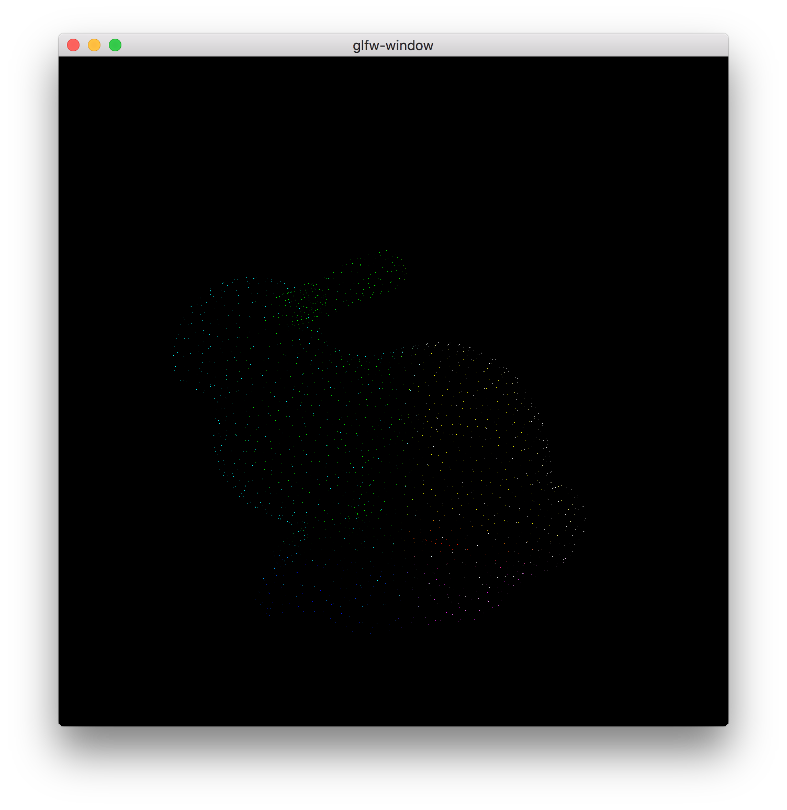

bunny
=====

Stanford Bunny abstract simplicial complex



## install

```sh
$ clib install glisy/bunny --save
```

## usage

```c
GlisyVAOAttribute position = {
  .buffer = {
    .data = (void *) StanfordBunny.positions,
    .type = GL_FLOAT,
    .size = sizeof(StanfordBunny.positions),
    .usage = GL_STATIC_DRAW,
    .offset = 0,
    .stride = 0,
    .dimension = 3,
  }
};
```

## license

MIT
